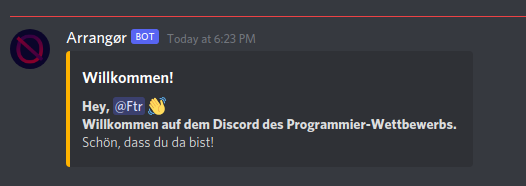

<div align="center">
    
    <hr>
    <h1>Arrangør</h1>
    <strong>
        Ein Discord Bot, der bei der Organisation des Programmier-Wettbewerbs hilft und zahlreiche Automatisierungen sowie ein (Web-) Dashboard bietet. 
    </strong><br><br>
</div>

---

## Funktionen des Bots
#### Begrüßung neuer Nutzer
Der Bot schickt automatisch eine Begrüßungsnachricht für neu gejointe Nutzer in den 'lobbychannel', welchen man in der config.json festlegen kann.



## Einrichtung / Konfiguration des Bots
Der Bot verfügt über eine 'Config-Datei', in die alle Daten eingetragen werden können, die er braucht, um zu funktionieren. Eine *'example.config.yml'* befindet sich im Ordner 'config'. Diese kann einfach kopiert und/oder umbenannt werden zu *'config.yml'*. Nachdem dies erledigt ist, müssen die Werte in die Config eingetragen werden (siehe Kommentare in der Datei).

Zudem muss in ```web/src/config.js``` noch die URL eingetragen werden, unter der der Bot (bzw. seine API) erreichbar ist.

Weitere Dokumentation folgt.

<br>

**Einsendung für den Programmier-Wettbewerb der "Digitalen Woche 2021 Leer" von Fabian Reinders.**